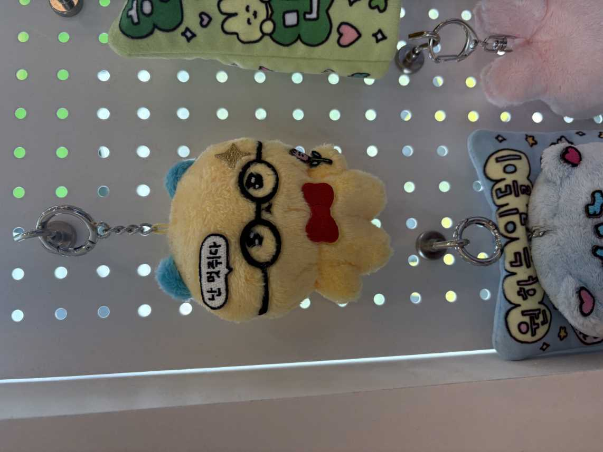

# 제주도 여행 6월말~

원래도 즉흥 여행을 다녀오고 싶었는데 이번에 기회가 되어서 다녀왔다.

마침 백수인 친구가 있어서 둘이 같이 여행메이트가 되어서 즐겁게 놀았다~

#### 첫 날

제주도 가는 비행기 안

나를(?) 반갑게 맞이해주는 제주 돌하르방

첫번째로 간 곳은 코난해변이었는데 당시에 구좌에서 유명한 당근 솥밥을 먹기로 해놓았어서 바로 왼쪽 코난해변쪽에서 놀았다.

친구 초상권 보호(?) 얼굴 나온건 안올렸으니..

둘이서 이러고 한참을 놀다가

말젯문으로 가서 당근 크림 덮밥이랑 문어 덮밥을 시켰다. 딱새우를 먹으러 갔지만 우리가 갔을 시기에는 딱새우는 안한다고 해서 1차 슬픔...

하지만 당근 크림 덮밥이 맛있었으니 이득!

개인적으로는 당근>>>> 문어 순으로 맛있었다. 당근만 들어있는건 아니고 돼지고기도 들어있다.

두 번째로 아베베 베이커리를 갔는데 항상 제주도에 같이오는 친구가(여행 메이트 및 구 룸메 및 내 이펙트 노예) 크림류를 못먹는 친구라 이 친구가 안왔을때 제주도에서 크림류를 잔뜩 먹고가야 한다는 마음으로... 크림빵으로 유명한 아베베 베이커리를 다녀왔다.

아베베 베이커리에서 한장

그 뒤 제주 동화마을로 이동했다.

기도를 하면서 3번 돌면 소원이 이루워진다는 돌.

무슨 소원을 빌었는지는 비밀이다.

산책로 주변에는 인공폭포를 만들어 놓았는데 갔을 시기가 조금 더웠던 시기라 안에 들어오니 시원해서 좋았다.

제주 동화마을에서 인공산(?)도 올라가고 수국도 보고 돌한테 소원도 빌다 예약해놓은 음식점이 있어서 음식점으로 이동했다.

후후 유명한 제주 몽탄 예약에 성공했다! 시간이 너무 애매하긴 했는데... 4시였나... 예약을 해놓았으니 먹어야지!

고기를 먹고

볶음밥까지 완벽하게 해치웠다.(내 위장이 자랑스럽다)

나오는 길에 최고심 키링 인형도 구경했는데 아직도 못산게 한... 다음에 제주도에 가면 구매하지 않을까...

그 뒤에는 숙소가 남쪽 끝 중문이라 차를 타고 멀리멀리 내려가 숙소에서 좀 쉬다가 자기 전 스타벅스에서 제주한정 음료를 먹으러 갔다.

개인적으로 제주도를 올때마다 한정음료 도장깨기를 하나씩 하고 있는 중이라 나는 이미 전부 다 먹어봐 디카페인 아이스아메리카노로...

---

#### 둘째 날

첫 날은 너무 어두워서 뒤가 보이지 않았는데 아침에 일어나니 숙소는 나름 오션뷰를 주셔서 친구랑 바다구경을 했다.
