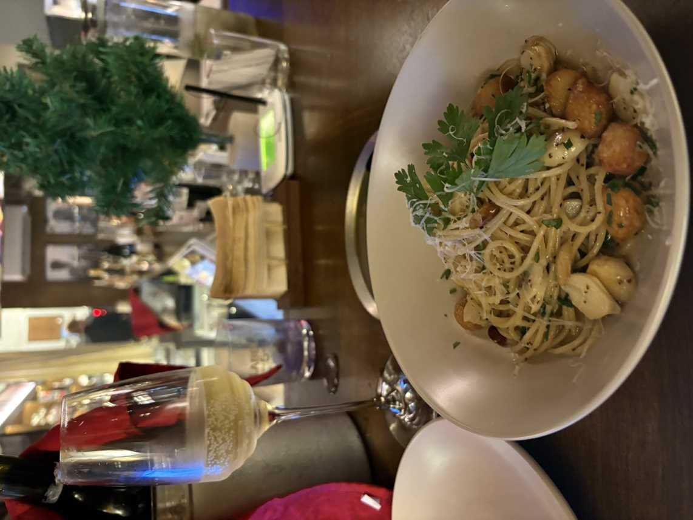
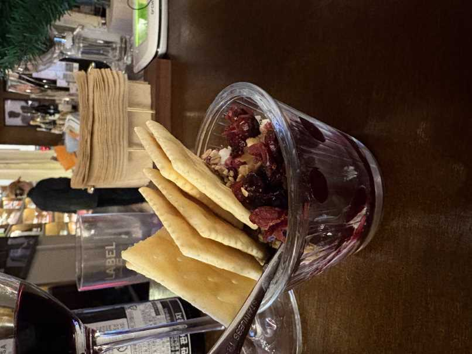
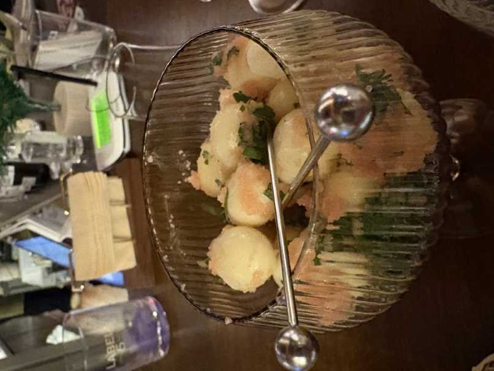
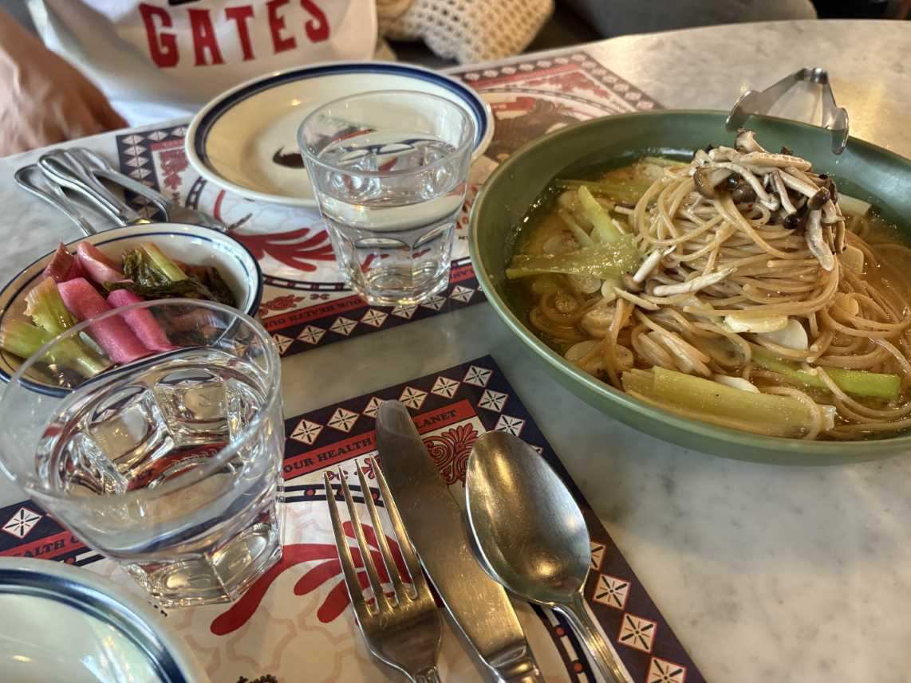

## 가봤던 맛집

#### 다산 피테일(유선심 추천)

식전빵과 샐러드(저 샐러드 치즈 진짜 맛있었다...!)

유선씌가 추천해준 뇨끼 내가 먹어본 뇨끼중 탑 !

성게알 파스타

저 파스타는 유선이가 해산물을 싫어한다고 해서 대신 먹어달라고 해서 시켰는데 진짜 너무 맛있어서 놀랐다.

너무 맛있어서 좀 더 먹어보려고 국물까지 퍼먹은듯

안그래도 마침 구리에서 토욜마다 다영쓰를 만나고 있어서 근처가 다산이라 같이 먹으러 가기로 했다.

#### 신논현역 사퀴테리 서울 

전 룸메랑 와인을 먹자고 해서 근처에 가까운곳을 찾아 갔는데 와인보다 사장님 음식솜씨가... 굳.

분명 조금만 먹자고 했는데 정신을 차려보니 둘이서 와인3병에 포트와인 잔 안주 네가지를 시켰다... 

달달한 화이트와인으로 시작하는 알리올리오. 

연어 빠삐요뜨

수제 리코타 치즈 크래커

명란 치즈볼

그리고 기억이 가물가물한테 우리가 너무 많이 먹어서 사장님이 위스키 팥빙수는 서비스로 내주셨다.

사장님이 시킨 와인에 따라서 어울리지 않는 안주는 추천을 안해주시는데 그게 너무 믿음직스러워서 다음에 또 가기로 친구와 다짐했다.(신남)

#### 학동역 모스가든

뭘시켜도 맛있고 비싼곳이다. 비싼만큼 값을 한다는 느낌이라 좀 맛있는 파스타가 먹고 싶을때 통장 생각을 의식적으로 피하면서 가면 좋은 곳이다.
