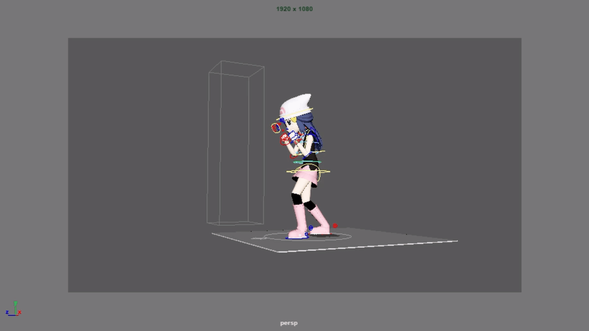
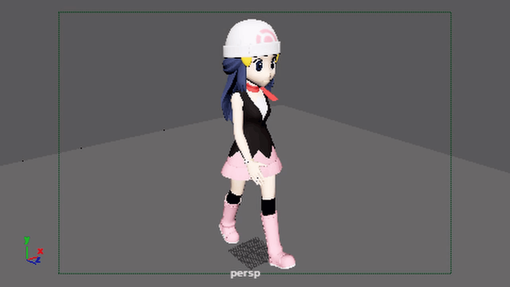
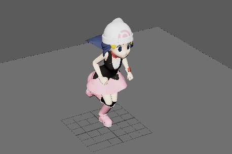
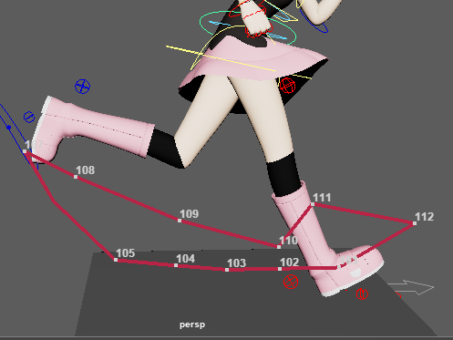
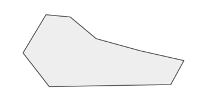

게임을 만들면서 코딩도 대충하고 그림도 대충 그릴줄 알게 되었지만...

문제는 애니메이션...

~~(이펙트는 해줄사람이 있다 🥺 알지?)~~

마침 한국 애니메이션계에서 대기업인 S모 회사에 다니는 동기 다영신이 계셔서 그 분의 천재적인 기술력과 내가 알고있는 게임의 기술력(이라고 해봤자 유니티, 언리얼 사용법)을 맞바꾸고 저렴한 가격으로 다영신이 과외를 해주기로했다.

이것이 인맥..!

대충 모델링(이라고 말하는 폴리곤 덩어리)은 할 줄 알지만 애니메이션은 정말 잘 몰라서 헤헷 즐겁게 듣고있다.

------

**1주차**

마야 인터페이스 설명

필요한 MEL스크립트 설치

애니메이션 세팅관련 핫 키 설치

애니메이션 12원칙

------

**2주차**

Bouncing Ball animation

Pendulum animation

Tail animation

오토 탄젠트D

키 포즈 찍은 후 올키 찍기

공이 전진하는 값에서 50%를 곱하면 공이 회전하는 것 처럼 보임

공이 땅에 닿을 때 360 540 이런식으로 치우치지 않게 정수값으로

보통 프레임을 넣을때는 3 프레임씩 밀어서 빼기

세컨더리 애니메이션은 그래프가 더러워져도 느낌적 느낌으로(?) 넣음

------

##### 3주차

이번주는 마야에서 사용하는 리그과 펀치 오버슛을 공부 했습니다

특히 오버슛 같은 경우는 생각보다 별게 없는데 디테일을 올려주는 것 같아서 잘 써먹고 있다

그리고 마야 작업자들이 많이쓰는 드림월 리그 피커를 깔아서 써봤는데 https://github.com/DreamWall-Animation/dwpicker 익숙해지니까 굉장히 편해서 앞으로도 애용 할 것 같음 (트윈 모션은 왜 안깔릴까.... 흐흑)

------

##### 4~5주차

워크사이클과 런 사이클을 공부했습니다.

워크 사이클까지는 괜찮았는데 런 사이클에서 자꾸 다리가 튀는? 듯한 느낌을 받았는데 

마야의 트레일 트렉으로 찍어보니(알려주셨는데 어떻게 사용하는지 까먹어서 6주차에 가서 여쭤봄 하핫)

키마다 스페이싱이 튀는 부분이 있었고 발의 아크가 물방울 모양을 그리지 않고 되게 이상한 모습을 그리고 있어서  

스페이싱과 아크가 더러운 모션의 예

원래는 발의 아크가 이런 식으로 나와야 한다고 한다. 딱봐도 더러운 아크의 형태 

모션 트레일을 사용해서 계속 체크를 하니 상당히 괜찮아져서 흡족.... 

------

##### 6주차
